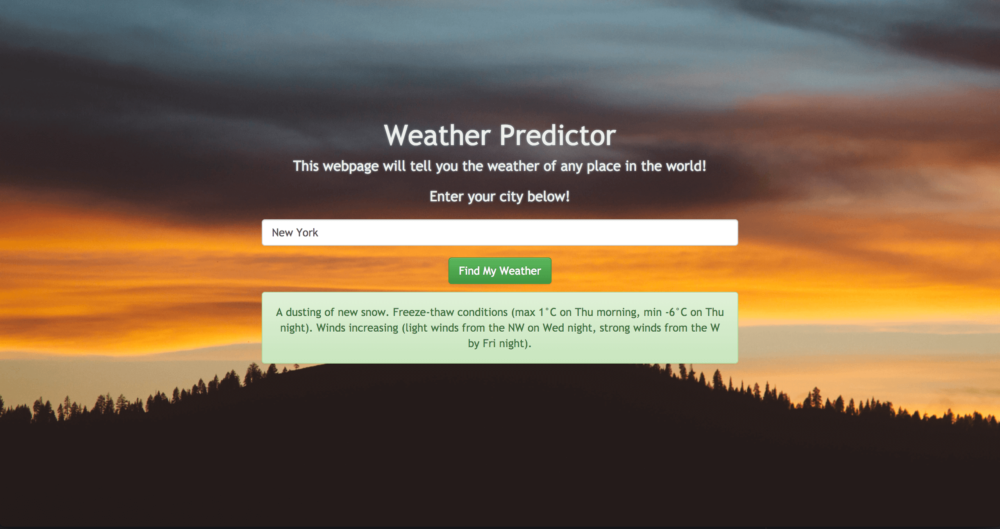
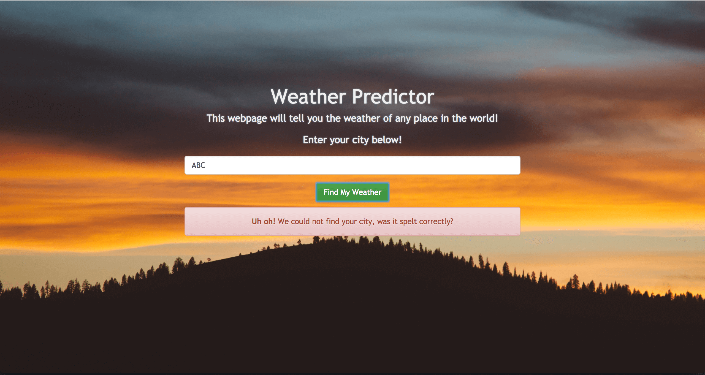

# Weather Finder

#### Installation and setup

- Download or clone the repo
- [GitHub link](https://github.com/timrooke1991/weather-finder)

This Weather Finder App is available to view and register [here.](https://glacial-woodland-57032.herokuapp.com/)

## Project Description

> **Note**: Any project using data scraping from a third-party website should abide by the robots.txt policy of the third-party website

This site can be used to get the weather forecast for any place in the world. The aim of the project was to get more comfortable with PHP and build a polish website using the PHP programming language. It uses techniques such as data scraping to retrieve the weather from `www.weather-forecast.com`.

   

### Features

There is less emphasis on the design and look of the site. However, to ensure things looked presentable, I relied on Bootstrap for many of the elements. I also got a nice, high-res image from unsplash.com for the background. jQuery is used to display and hide alerts to the user - this done using fadeIn() and fadeOut(). The site uses AJAX to load data, so the site does not refresh when fetching and retrieving weather data.

In order to get the data, I use PHP to scrap the 3 Day Weather Forecast Summary from `www.weather-forecast.com`. Scraping is a useful technique as it allows you to accumulate date quickly and easily, but also allows you to build dynamic web applications with relative ease. Once I appended the input to a weather-forecast string to create the required URL, I use `preg_match` to perform a regular expression match on the source code, which returns the corresponding 3 Day Weather Forecast Summary text.

There is some basic validation on the site. If a forecast can’t be found, it prompts the user to check their spelling. Also, if nothing is entered, it prompts the user to enter a city.

### Technologies used

The list of the software and languages used in the project, for example:

- HTML5
- CSS
- JavaScript
- Bootstrap
- jQuery
- PHP
- Regular Expression
- Data Scraping
- Git
- Github

### What I learned

The main benefit for me of this project was understanding more about data scraping, working with PHP and with Regular Expressions to build a dynamic web application.

### Rounding it off

Improvements that I would like to make to the project in the future would be:

- The site currently returns a 3-day forecast. This could be improved by return multiple forecasts. For example, 3-day, 5-day, 7-day as well as current temperature and other information.
