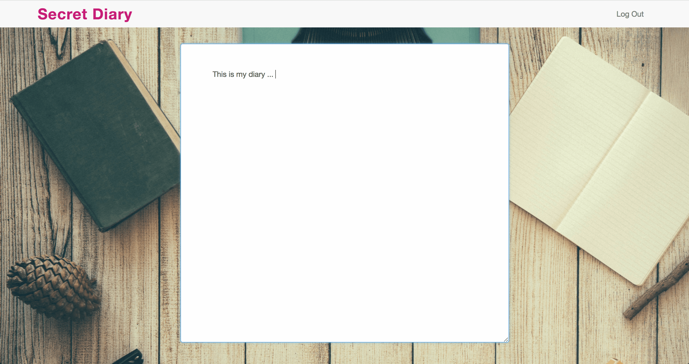

# Secret Diary

#### Installation and setup

- Download or clone the repo
- [GitHub link](https://github.com/timrooke1991/secret-diary)

This Secret Diary App has been taken offline. This was an early project that I did to understand PHP and MySQL several years ago. The md5 hashing algorithm is now not a suitably secure password storage mechanism, so as a result I have taken this application offline.

## Project Description

This is a web app called Secret Diary, where users can register and login to keep a record of their thoughts and ideas. The aim of the project was to explore more around PHP functionality as well as understanding how to integrate a database to a web application. Here, I am using MySQL.

   

### Features

The project required some basic styling to make it look presentable. I used Bootstrap elements for the navigation, inputs and buttons - this allowed the site to be responsive. A cool feature of the project is the auto-save feature. When a user types, the content will be automatically saved to the database - similar to Google Docs. As a result, there is no requirement for the user to manually click save with every new edit that they make.

In the web application database, I am storing email, password and diary content. Storing passwords obviously requires an additional layer of security. To do this, I used an md5 hash to encrypt the user's password combined with a salt value that is unique to every user, which is then hashed again.

Also, as the application has a login and logout element, I also used session variables to track whether a user is logged into the app. Using a specific `loggedin.php`, the site tracks whether the user is logged across the different pages loaded by the app. Conversely, if the user manually logs out of the application the session variable is then destroyed.

### Technologies used

The list of the software and languages used in the project, for example:

- HTML5
- CSS
- JavaScript
- Bootstrap
- jQuery
- PHP
- MySQL
- Git
- Github

### What I learned

This allowed me to learn more about server-side functionality, particularly authentication and database integration. This is the first application I created, which used a database, so I learnt my first SQL syntax and the logistics of setting up a database.

Also, this was the first app that I created that used authentication. I learnt about methods of storing passwords securely using hashing and encryption. Lastly, I learnt about cookies and session variables to store useful information about a user. For example, in this particular app, I use session variables to track whether or not a user is logged in as they move from different pages.

   

### Rounding it off

Improvements that I would like to make to the project in the future would be:

- The site is a basic app that saves information to a database. The app is designed to be a diary - so I would add some formatting functionality so that a user add formatting to their diary entries.
- Potentially, I would like to add some functionality for users to interact with each other and send each other messages.
