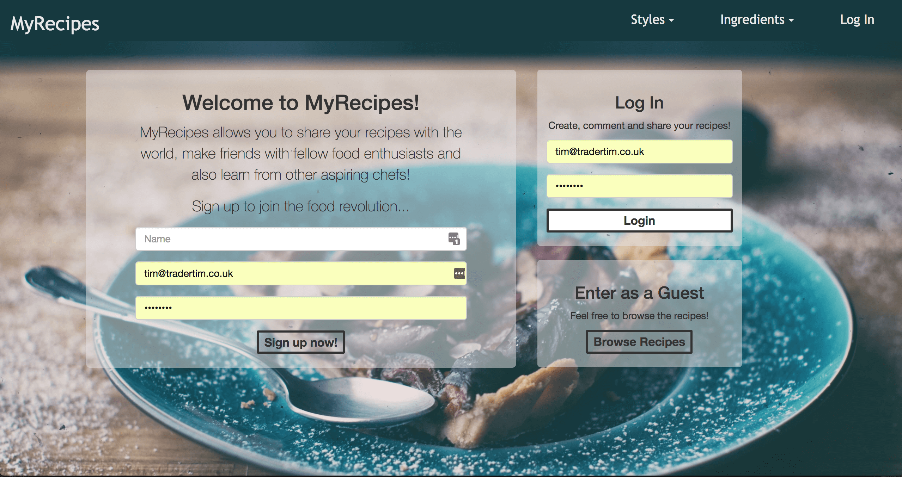

# myRecipes

#### Installation and setup

- Download or clone the repo
- `bundle install` to install dependencies

> **Note**: You'll need to have `ruby` installed globally

- [GitHub link](https://github.com/timrooke1991/myrecipes)

MyRecipes App is available to view and register [here.](https://myrecipestr.herokuapp.com)

## Project Description

This was the first project using Ruby and Rails. I wanted to build a simple web RESTful app. I decided to build an app where users could post recipes, list ingredients and like other people's recipes. The main aim of this was to build a typical web app in a different programming language and using a different framework.  

   

### Features

The primary object of this project was to build an app in a new language and new framework. However, this app incorporates additional features that I had not built before. It uses login and authentication. All users can view recipes, however, certain actions on the site - such as posting recipes, liking recipes and adding styles and ingredients - are only available to registered users. It has a like-voting system - allowing users to vote or downvote recipes posted by other users. It incorporates image upload with the help of `carrierwave` for both profile images and recipe images. This feature utilises Amazon S3 for storage. In addition to this, I used the `miniMagick` gem to resize images to a required size.

User roles was something that I incorporated into this project. The idea was that this app would be community driven. Therefore, I wanted to add functionality for specific users to be admins or moderators with higher-level permissions granted to them. For example, this allows them editing and deleting permissions over recipes that are not their own, which is not something available to a regular user. This functionality is quite common in real-world apps like StackOverflow, so I thought it would be useful to see how this would be achieved.

### Technologies used

The list of the software and languages used in the project, for example:

- HTML5
- CSS
- JavaScript
- Bootstrap
- AWS (S3)
- SQLite3
- ActiveRecord
- Ruby
- Rails 4
- Cloud9
- Git
- Github
- Heroku

### Challenges faced

The biggest challenge of the application was working with the Rails, which was a new framework for me. I found it quite daunting at first due to the number of files. However, once I became familiar with the syntax and the file structure, I got on board with it.

### Rounding it off

   

Improvements that I would like to make to the project in the future would be:

- Refinement of styling and layouts - other than the front page, the styling is a basic
- Add the ability for comments and/or reviews for specific recipes
