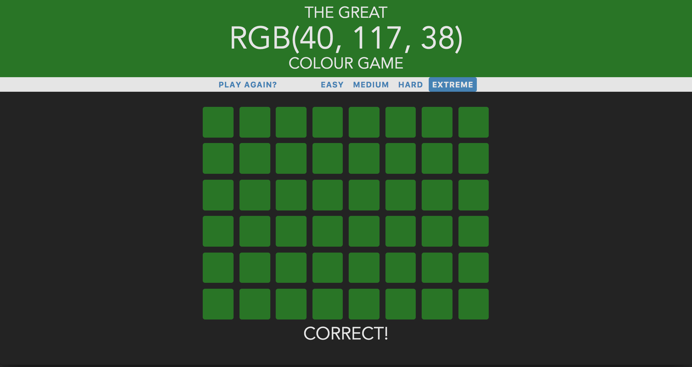
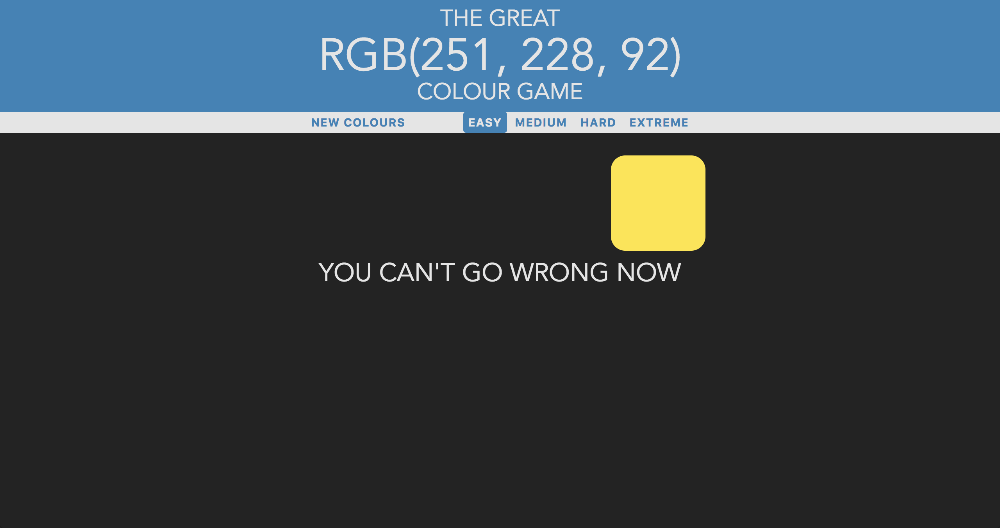

# Colour Guessing Game

#### Installation and setup

- Download or clone the repo
- Fire up `localhost`

- [GitHub link](https://github.com/timrooke1991/colour-picker)

The Colour Guessing Game is available to view and register [here.](https://calm-peak-80180.herokuapp.com/)

## Project Description

This was a simple browser game written in plain JavaScript. The aim of the game is to guess the colour based on the RGB colour value. The project allowed me to get a better handle on JavaScript events and vanilla JavaScript syntax.

   

### Features

The app displays a number of different coloured squares and asks the user to guess the provided RGB colour value. There are four different difficulty settings: easy (4 squares), medium (8 squares), hard (12 squares) and extreme (48 squares). The game is responsive and is fully functional on mobile and tablet devices.

In addition to the JavaScript function, the game utilises CSS3 animation features to ensure that user interaction is smooth and slick. Examples of this are visible when a user clicks a square, changes the difficulty setting or resets the game.

### Technologies used

The list of the software and languages used in the project, for example:

- HTML5
- CSS
- JavaScript
- Bootstrap
- Git
- Github

### What I learned

The main benefit for me of this project was understanding more about CSS3 animation and also vanilla JavaScript syntax. I have often used jQuery in previous projects.

I dedicated specific time to refactoring the code of this game. I tried to keep my code clean and DRY. Furthermore, I tried to split my code into specific functions, so that each function is doing one, explicit job. This made creating the game much simpler.

### Rounding it off

    

Improvements that I would like to make to the game in the future would be:

- I would like to add the option choose RBG or Hexadecimal value
- Some form of scoring system with a leaderboard and/or high score
