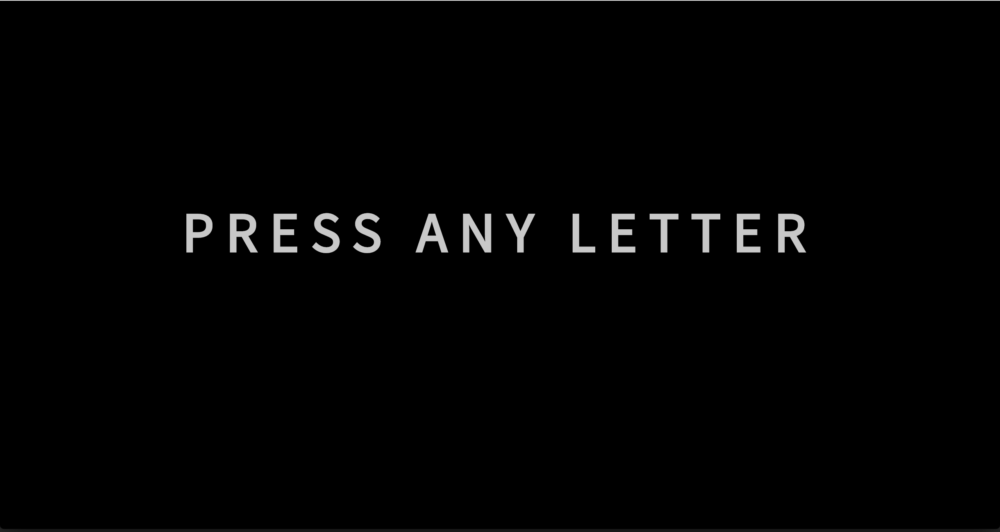
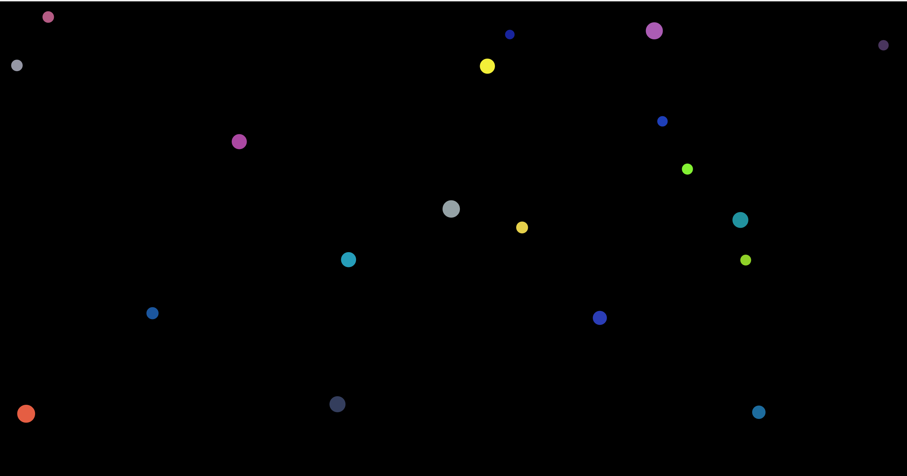

# Patatap Clone

#### Installation and setup

- Download or clone the repo
- Fire up `localhost`

- [GitHub link](https://github.com/timrooke1991/patatap)

This Patatap App is available to view and register [here.](https://whispering-brook-75411.herokuapp.com/)

## Project Description

This was a simple app to understand more about how JavaScript libraries work and fit into an application. The site is a basic clone of Patatap. The project uses two JavaScript libraries: `Paper.js` and `Howler.js`. Aside from the libraries, this project also allowed me to get more familiar with event drive behaviour in JavaScript.

   

### Features

The app plays audio sounds when a letter on the keyboard is hit. Each sound corresponds to a particular key. This is facilitated by the `howler.js` library. When a letter is hit, an animation is also create which is enabled by the `paper.js` library. The animation is a simple, shrinking circle - each letter key has its own corresponding colour. The colour changes as the circle shrink into the background.

### Technologies used

The list of the software and languages used in the project, for example:

- HTML5
- CSS
- JavaScript
- Bootstrap
- jQuery
- Howler.js
- Paper.js
- Git
- Github

### What I learned

The main benefit for me of this project was understanding more about animation and audio and how this can be used in web applications.

Also, it was useful to get familiar with more JavaScript libraries and understand how to incorporate external code from libraries into my own sites and applications.

### Rounding it off

   

Improvements that I would like to make to the project in the future would be:

- Like the actual Patatap site, I would like to create additional shapes with different keystrokes. Currently, my version just creates circles.
