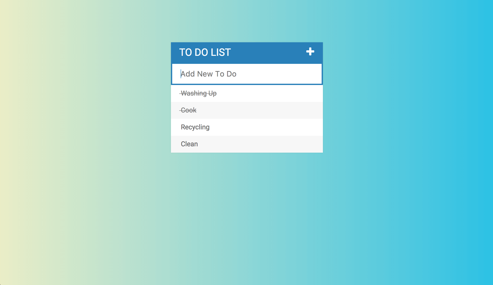

# jQuery To Do List

#### Installation and setup

- Download or clone the repo
- Fire up `localhost`

- [GitHub link](https://github.com/timrooke1991/jquery-to-do-list)

The jQuery To Do List is available to view and register [here.](https://still-springs-17633.herokuapp.com/)

## Project Description

This is a simple to do list app built with jQuery. The main aim of this project was to become more familiar with the jQuery library.

   

### Features

The app has a decent level of styling. It is responsive, so works cleanly across devices of all shapes and sizes. The site uses a Google Font, `Roboto`, as well Font Awesome icons to improve the look and feel. Also, the background is created using CSS gradients and the `box-shadow` property is used to create a more polished appearance. The adding and removal of to do items is aided by CSS animation.

The site incorporates hover effects such as displaying the bin icon when a user wishes to delete an item. Once clicked, it will will remove the parent `li` element. This required a delegation event. I used `event.stopPropagation()` in the event listener to prevent the event ‘bubbling’ up the DOM tree further than required.

Some animation of the app is achieved through jQuery fading and sliding functionality. There is also a cross-out feature, which is achieved using the jQuery `toggleClass()` function. If a user clicks on the text of an item, it will manipulate the class, so that it has a strike through the item. A user can toggle this on and off.

New items can be added by typing them into the input box and hitting the enter key. This is keypress events as well utilising the jQuery `append` method. The input form can be hidden by clicking the plus symbol.

### Technologies used

The list of the software and languages used in the project, for example:

- HTML5
- CSS
- JavaScript
- jQuery
- Bootstrap
- Git
- Github

### What I learned

The main benefit for me of this project was to become more familiar with the jQuery library.

In this project, I used `keypress` event listeners. For example, when the enter key was pressed, this append the task to the to do list. Previously, I had used event listeners like `click` and `change`, but configuring event listeners for specific keystrokes was new to me.

### Rounding it off

Improvements that I would like to make to the game in the future would be:

- I would like to add the ability to prioritise to dos and flag to dos depending on levels of difficulty and/or priority
