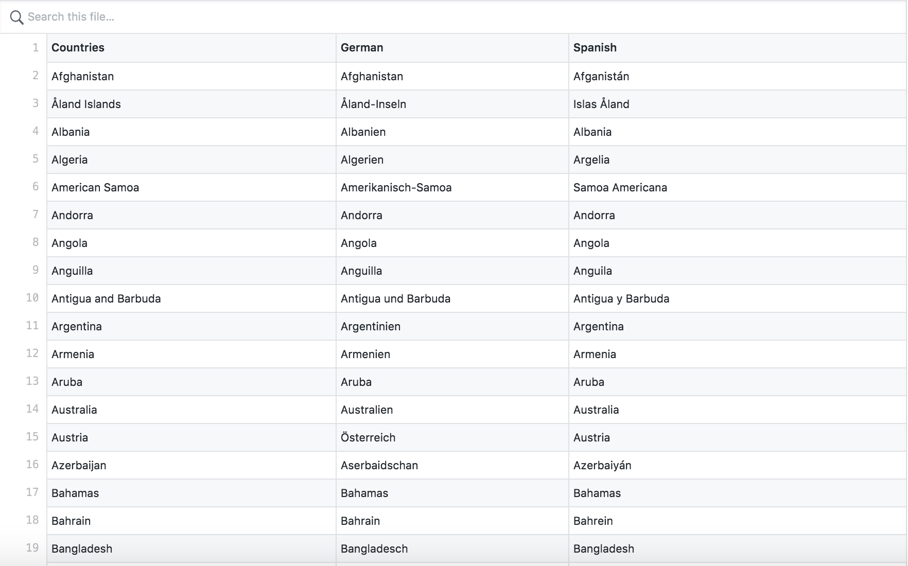
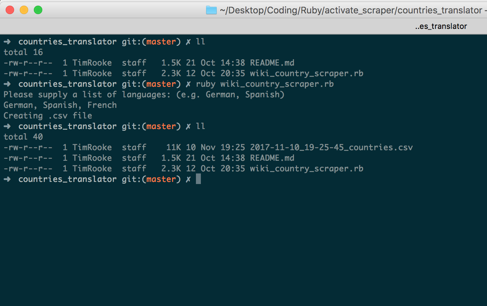

## Country Translator

<figure>
	
	<figcaption>A simple command line tool that translates country names from English to another chosen language and returns a csv</figcaption>
</figure>

### Installation & Setup

#### Run Locally

- Download or clone the [Github repo](https://github.com/timrooke1991/country_translator)
- Navigate to the root of the repo via the command line
- Run `bundle install`
- Run `ruby wiki_country_scraper.rb` in the terminal to compile run the ruby program
- When prompted, enter the languages you require separated by a comma, e.g. German, Spanish, French (English is returned by default)
- Once completed, find the `.csv` file located in the root of the project directory

> **Note**: You'll need to have `ruby` installed

### Description

This is a simple command line tool that translates Country names from English to another chosen language. This is something that I required for a website that I was building, so spend some time converting it into a tool for others to use as well. The tool scrapes Wikipedia to get the required translation for 250 countries.

<figure>
	
	<figcaption>With a couple of commands, receive your translations as a csv file!</figcaption>
</figure>

### Technologies used

The list of the languages and gems used in the project:

- Ruby
- Open-uri
- Nokogiri
- csv
- Mechanize

### Notes

This tool utilises Wikipedia from translations, so makes the assumption that these translations are accurate.

Also, in the event a translation can not be found the program returns a string of 'not found'. Coverage does vary depending on the language requested.
