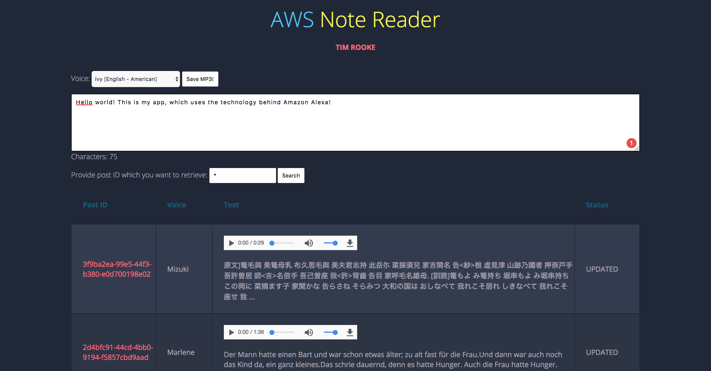

# AWS Note Reader

#### Installation and setup

- Download or clone the repo
- [GitHub link](https://github.com/timrooke1991/aws-note-reader)

AWS Note Reader app that is available to view [here.](https://s3.amazonaws.com/aws-note-reader-tr/index.html)

## Project Description

This S3 static website allows you to type text such as revision notes or thoughts and save them to a database. Once saved, these note can be converted to speech and read back to you. I build this site while studying for my AWS Developer Associate exam to become more comfortable with the AWS ecosystem. It uses a number of AWS resources to perform the tasks and functions of the app.

<figure>
	
	<figcaption>Write some text, choose a voice and have it read back to you in seconds!</figcaption>
</figure>

### Features

The website is a simple static website, which is stored on Amazon S3. The site uses a simple form, which accepts some text and the selection of Polly voice that the user wants their text converted to. The conversion from text to audio was the most complicated aspect of the site. Firstly, I needed to save the data to the database. The successful saving of the data would interact with SNS, AWS Simple Notification Service, to push a notification to the Polly service communicating that a new item had been saved. This would trigger the `coverttoaudio` lambda function, which would split the save text into 1,000 character chucks for processing through the Polly service in the voice that the user had specified. This is done for each chuck of text (1,000 charters long). When finished, it is stitched back together and saved as an `.mp3` file on S3.

### Technologies used

The list of the software and languages used in the project, for example:

- HTML5
- CSS
- Python
- AWS S3
- AWS Polly
- AWS Lambda
- AWS Simple Notification Service
- AWS DynamoDB
- Git
- Github

### What I learned

I built this site while studying for my AWS Developer Associate exam to become more comfortable with the AWS ecosystem. It taught me a lot about how AWS resources work together. This was a 'serverless' project. Experimenting with Functions as a Service was interesting. It required me think more about what my specific functions were doing.

### Rounding it off

Improvements that I would like to make to the project in the future would be:

- Improve the chunking of the message, rather than break at 1,000 characters look for spaces or full stops. This would create a better transcription.
- Improve search functionality of the database
